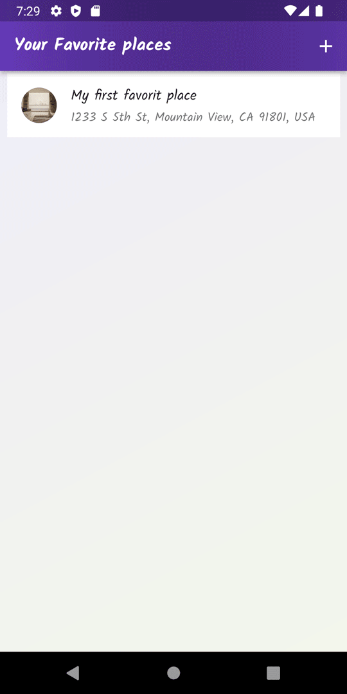

# favorite_places

An application made to save users favorite/importent places. Data is kept on the device using sqflite, additionaly user cant take a picture of favorite place 
and position using google maps.

## Screenshots

## Development

project uses couple dependecys like:
- [provider](https://pub.dev/packages/provider)
- [image_picker](https://pub.dev/packages/image_picker)
- [path_provider](https://pub.dev/packages/path_provider)
- [sqflite](https://pub.dev/packages/sqflite)
- [google_maps_flutter](https://pub.dev/packages/google_maps_flutter)

Full dependency list as usual in pubspec.yaml file.

## How to run

Application was designed for android devices (smartphone), but it should work on IOS (not tested).
I assume that You allready have Flutter SDK and Android virtual device installed. Aditionally You need to create a new project on Google Maps platform with Maps SDK, and Static Maps API. Once You create a project, google will generate an API key for it, that kye will be needed for this aplication to run properly. 

To run application:

- Download repository ZIP file or if You have Git clone repository to Your hard drive.
- Run Android virtual device.
- Copy Your Google API key and paste it to a constant named GOOGLE_API_KEY in project directory (./lib/helper/location_helper.dart).
- Open CMD and navigate to repository location.
- In command line type "flutter run" - if your virtual device is detected, flutter will automatically launch the application on the device.
